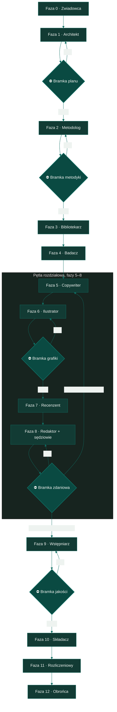

# Obron — pisanie prac naukowych z agentami AI

 

Projekt Obron to kompletny proces pisania pracy naukowej z wykorzystaniem agentów AI. Obejmuje on pełny cykl życia dokumentu. Proces zaczyna się od wyboru problemu badawczego, przechodzi przez projektowanie metodyki, realizację badań, redakcję tekstu, a kończy na składzie typograficznym gotowego dokumentu.

Punkt wyjścia projektu opiera się na diagnozie problemów z narzędziami generatywnymi. Agenci AI piszą i poprawiają tekst szybko, ale równie szybko wprowadzają ukryte defekty. Narzędzia te kasują fragmenty tekstu przy scalaniu równoległych zmian. Sklejają słowa przy masowych podmianach. Zostawiają sygnały tekstu generowanego maszynowo. Cytują źródła, które nie istnieją w rzeczywistości. 

Usterki te stają się widoczne dopiero na etapie oceny przez promotora lub recenzenta. Obron rozwiązuje ten problem architektonicznie. Cała metodyka opiera się na bramkach jakości umieszczonych przed wdrożeniem zmiany, a nie na audycie gotowego tekstu. Zasada nadrzędna jest niezmienna. Agent proponuje modyfikację, niezależna kontrola ocenia propozycję, a zmiana wchodzi do dokumentu wyłącznie po uzyskaniu pełnej akceptacji.

---

## Pisanie bez procesu vs z Obron

| Problem bez procesu | Mechanizm Obron |
|---|---|
| cytaty z pamięci modelu, 18–55% fabrykacji | rejestr źródeł jako jedyne źródło cytowań + jawny dług `[ŹRÓDŁO?]` |
| scalanie równoległych zmian po cichu gubi treść | liczniki integralności, migawka przed i po pracy w worktree |
| poprawka jednego zdania psuje sąsiednie | trzej niezależni sędziowie z hashem zaakceptowanego zdania |
| typografia wklejona ręcznie w źródło | separacja treści od składu, typografia wyłącznie w warstwie eksportu |
| wstęp napisany pierwszy obiecuje więcej, niż praca dowozi | wstęp pisany na końcu, według modelu CARS |
| „skrypt się wykonał" traktowane jako dowód poprawności | wynik oceniany po treści diffu, nie po kodzie wyjścia |

---

## Spis treści
1. [Pisanie bez procesu vs z Obron](#pisanie-bez-procesu-vs-z-obron)
2. [Architektura procesu](#architektura-procesu)
3. [Kluczowe mechanizmy inżynieryjne](#kluczowe-mechanizmy-inżynieryjne)
4. [Zasady pisania](#zasady-pisania)
5. [Jak to wygląda w praktyce](#jak-to-wygląda-w-praktyce)
6. [Szkielet domyślny: IMRaD](#szkielet-domyślny-imrad)
7. [Zarządzanie źródłami i badaniami](#zarządzanie-źródłami-i-badaniami)
8. [Warsztat analityczny](#warsztat-analityczny)
9. [Ilustracje](#ilustracje)
10. [Instalacja i użycie](#instalacja-i-użycie)
11. [Zastrzeżenie](#zastrzeżenie)
12. [Licencja](#licencja)
13. [Autor](#autor)

---

## Architektura procesu

Proces dzieli się na trzynaście faz i wykorzystuje osiem ról agentów oraz pięć bramek jakości. Fazy od piątej do ósmej działają w pętli dla każdego rozdziału z osobna. Pozostałe etapy mają charakter liniowy.



*   **Faza 0 (Zwiadowca):** Ustalenie typu pracy, wymogów formalnych konkretnej uczelni oraz harmonogramu liczonego wstecz od daty złożenia pracy.
*   **Faza 1 (Architekt):** Budowa łańcucha logicznego pracy. Temat prowadzi do problemu, problem do celów, cele do hipotez, a hipotezy do spisu treści. Faza kończy się Bramką Planu.
*   **Faza 2 (Metodolog):** Tworzenie protokołu przed badaniem. Obejmuje on prespecyfikację, ustalenie okna kalibracji materiału i plan analizy statystycznej. Faza kończy się Bramką Metodyki.
*   **Faza 3 (Bibliotekarz):** Budowa rejestru zweryfikowanych źródeł. Rejestr ten stanowi jedyne źródło cytowań dla całej pracy.
*   **Faza 4 (Badacz):** Realizacja badania zgodnie z zamrożonym protokołem. Wynikiem jest plik ustaleń faktograficznych.
*   **Faza 5 (Copywriter):** Pisanie rozdziałów w formacie Markdown. Obowiązuje zakaz cytowania spoza rejestru i zakaz wymyślania liczb.
*   **Faza 6 (Ilustrator):** Projektowanie grafiki z uwzględnieniem fizycznych limitów strony. Faza kończy się Bramką Grafiki.
*   **Faza 7 (Recenzent):** Ocena stanu całego dokumentu pod kątem rzetelności, merytoryki i struktury.
*   **Faza 8 (Redaktor):** Naniesienie poprawek zdaniowych zgodnie z uwagami. Zmiany przechodzą przez rygorystyczną Bramkę Zdaniową.
*   **Faza 9 (Wstępniarz):** Tworzenie wstępu, zakończenia i streszczenia. Etap ten następuje dopiero po napisaniu głównej części pracy. Faza kończy się zbiorczą Bramką Jakości.
*   **Faza 10 (Składacz):** Separacja treści od typografii. Pliki Markdown są konwertowane do formatów docx i PDF z użyciem szablonu referencyjnego.
*   **Faza 11 (Rozliczeniowy):** Generowanie arkusza zmian dla promotora. Arkusz zestawia stan poprzedni z nowym wraz z dokładnymi cytatami i numerami stron.
*   **Faza 12 (Obrońca):** Przygotowanie prezentacji i odpowiedzi na przewidywane pytania komisji. Obejmuje próbę generalną z adwersarzem.

---

## Kluczowe mechanizmy inżynieryjne

Projekt Obron eliminuje halucynacje i regresje poprzez system twardych reguł i niezależnych weryfikatorów. Precyzja tych mechanizmów decyduje o bezpieczeństwie tekstu.

### Bramka zdaniowa i trzej sędziowie
Model językowy, który napisał poprawkę, nie potrafi obiektywnie ocenić własnego błędu kontekstowego. Z tego powodu proces redakcji wykorzystuje pipeline z trzema niezależnymi sędziami wywoływanymi równolegle. Pierwszy sędzia ocenia wyłącznie poprawność gramatyczną i styl samego zdania. Drugi sędzia weryfikuje dopasowanie zdania do kontekstu akapitu i brak sprzeczności logicznych. Trzeci sędzia sprawdza, czy zmiana realizuje przypisaną uwagę bez łamania innych wytycznych.

Akceptacja zmiany wymaga uzyskania pozytywnego werdyktu od wszystkich trzech sędziów. Każdy werdykt pozytywny musi zawierać skrót kryptograficzny (hash) zaakceptowanego zdania. Mechanizm ten gwarantuje, że w pętli poprawkowej stary werdykt nie zostanie przypisany do nowej, niezweryfikowanej wersji tekstu. Zdanie, które nie przejdzie bramki dwa razy z rzędu, trafia do decyzji człowieka.

### Bezpiecznik warstwy
Zarzut dotyczący struktury całego dokumentu nie może blokować poprawki pojedynczego zdania. Redaktor pracuje na poziomie akapitu. Wymaganie od niego ujednolicenia terminu występującego w pracy dwieście razy prowadzi do nieskończonej pętli odrzuceń. Bezpiecznik warstwy nakazuje sędziom przepuszczać poprawne zdania i zgłaszać problemy globalne jako osobne zadania dla całej pracy.

### Idempotentność podmian masowych
Skrypty modyfikujące tekst muszą dawać identyczny wynik przy jednokrotnym i wielokrotnym uruchomieniu. Klasyczna awaria polega na zamianie słowa "zrobił" na "zrobiła". Ponowne uruchomienie skryptu na tekście już poprawionym tworzy formę "zrobiłaa". Projekt Obron wymusza stosowanie wyrażeń regularnych z granicą słowa. Wynik operacji ocenia się po przeczytaniu różnic w treści, a nie po zerowym kodzie wyjścia skryptu.

### Kontrola integralności przy pracy równoległej
Git nie zgłasza konfliktów scalania w miejscach, w których plik modyfikowała tylko jedna strona. Agent pracujący na nieaktualnej gałęzi może bezpowrotnie skasować cudzą pracę. Obron wymusza zliczanie elementów przed i po pracy. Liczniki rosnące, takie jak liczba rysunków, tabel czy cytowań, nie mają prawa spaść po scaleniu. Liczniki malejące, takie jak liczba anglicyzmów z zamkniętej listy, nie mają prawa wzrosnąć. Pomiary wykonuje się zawsze na tekście po transformacji eksportu.

### Separacja treści od typografii
Pliki źródłowe w formacie Markdown nigdy nie zawierają decyzji typograficznych. Twarde spacje, justowanie tekstu, wcięcia akapitowe czy usuwanie znaków pauzy realizowane są wyłącznie w warstwie eksportu. Ręczna edycja plików docx jest zakazana. Dokument wynikowy jest zawsze generowany ze źródeł, co zapobiega utracie pracy przy kolejnym eksporcie.

---

## Zasady pisania

Redakcja tekstu w projekcie Obron opiera się na zestawie twardych reguł językowych, spisanych w `referencje/styl-polski.md`. Reguły te obowiązują każdego agenta piszącego i redagującego tekst, niezależnie od fazy procesu.

Zdanie musi wynikać ze zdania poprzedzającego. Podmiot niesie informację, którą czytelnik już zna, a orzeczenie wprowadza informację nową — odwrotna kolejność zmusza czytelnika do ponownej lektury akapitu. Z tej samej zasady wynika zakaz wprowadzania terminu specjalistycznego, zanim zostanie zdefiniowany: pojęcie pojawia się w tekście dopiero po tym, jak czytelnik dostał jego znaczenie, nigdy wcześniej.

Długość zdania podlega twardemu progowi trzydziestu pięciu słów. Zdanie mieszczące się między dwudziestoma pięcioma a trzydziestoma pięcioma słowami wymaga podziału, jeśli niesie więcej niż jedną myśl. Forma bezosobowa obowiązuje bezwyjątkowo — "przeprowadzono", "zmierzono", "zaobserwowano" — z wyjątkiem jawnego oddzielenia stanowiska autora od stanowiska cytowanego źródła.

Liczby w prozie podlegają osobnej dyscyplinie. Jedno zdanie niesie najwyżej jedną liczbę, zawsze zinterpretowaną, nigdy samą w sobie. Akapit zawierający więcej niż trzy wartości liczbowe przenosi je do tabeli, a proza zatrzymuje wyłącznie wniosek.

Siła twierdzenia musi odpowiadać sile dowodu, który za nim stoi. Wynik statystycznie nieistotny opisuje się jako brak dowodu na różnicę, nigdy jako dowód jej braku — to rozróżnienie decyduje o tym, czy praca formułuje wniosek uprawniony, czy nadinterpretowany.

Katalog zakazów ma zawsze przypisany konkretny zamiennik, nie samo ostrzeżenie:

| Zakazane | Zamiennik |
|---|---|
| myślnik w prozie | przecinek, nawias albo nowe zdanie, zależnie od funkcji wtrącenia |
| dwukropek dokańczający zdanie | rozbicie na dwa zdania |
| pytanie retoryczne | zdanie oznajmujące z tezą |
| metafora | opis konkretu, najlepiej z liczbą |
| anglicyzm bez glosy | polski odpowiednik albo objaśnienie przy pierwszym wystąpieniu |
| wyliczenie zbite w jednym zdaniu | lista punktowana albo konstrukcja "Pierwszym… Drugim…" |

---

## Jak to wygląda w praktyce

Bramka zdaniowa (Faza 8) ocenia każde przepisane zdanie trzema niezależnymi werdyktami, zanim zmiana wejdzie do pracy. Poniżej jeden przebieg na realnej parze z `referencje/styl-polski.md`, kategoria A3 — anglicyzm bez glosy.

**Zdanie przed:**
> „Pomiar wykonał zbudowany na potrzeby pracy harness realizujący pętlę prompt → kod → testy → informacja zwrotna."

**Werdykty trzech sędziów:**
- **ZDANIE** — FAIL: anglicyzmy „harness" i „prompt" bez polskiego odpowiednika ani glosy przy pierwszym wystąpieniu.
- **KONTEKST** — PASS: zdanie nie wprowadza sprzeczności z sąsiednimi akapitami rozdziału.
- **UWAGI** — FAIL: nie realizuje uwagi promotora o zastąpieniu zapożyczeń terminami polskimi.

**Zdanie po** (komplet PASS, wchodzi do pracy):
> „Pomiar wykonała zbudowana na potrzeby pracy obudowa pomiarowa (ang. *harness*). Realizuje ona pętlę złożoną z polecenia, wygenerowanego wyniku, uruchomienia testów i informacji zwrotnej."

---

## Szkielet domyślny: IMRaD

Struktura pracy w Fazie 1 nie powstaje od zera przy każdym projekcie. Architekt stosuje domyślnie układ IMRaD — wprowadzenie, metody, wyniki, dyskusję — jako punkt wyjścia do budowy spisu treści, a odstępstwo od tego szkieletu wymaga uzasadnienia typem pracy, nie preferencją stylistyczną. Sześć typów prac według charakteru, każdy z własnym wzorcowym spisem treści, jest opisanych w `referencje/typy-prac.md`.

Wstęp w tym układzie powstaje według modelu CARS, w trzech ruchach następujących po sobie. Pierwszy ruch, terytorium, prowadzi czytelnika od ogólnego kontekstu do konkretnego obszaru badania. Drugi ruch, luka, wskazuje, czego dotychczasowa literatura nie ustaliła — sygnałem gramatycznym tego ruchu jest spójnik przeciwstawny albo przeczenie, a jego brak oznacza, że wstęp nie uzasadnia, po co praca powstała. Trzeci ruch zajmuje wskazaną lukę, formułując cel pracy. Zakres opisanej luki musi się równać zakresowi zapowiedzianego celu — luka opisana szerzej niż cel jest obietnicą bez pokrycia, a cel szerszy niż luka twierdzeniem, że praca robi więcej, niż uzasadniła.

Dyskusja, rozdział czytany przez recenzentów najuważniej, ma siedmiopunktową strukturę kanoniczną: główny wynik podany jednym zdaniem bez liczb, mocne i słabe strony badania, zestawienie z literaturą z naciskiem na różnice, mechanizm tłumaczący uzyskany wynik, implikacje praktyczne i teoretyczne, ograniczenia z podanym kierunkiem obciążenia, pytania otwarte i kierunki dalszych badań.

---

## Zarządzanie źródłami i badaniami

### Rejestr źródeł jako jedyne źródło prawdy
Od 18 do 55 procent cytowań generowanych przez modele z pamięci to fabrykacje. Bibliotekarz tworzy scentralizowany rejestr źródeł. Copywriter ma bezwzględny zakaz cytowania pozycji spoza tego rejestru. Weryfikacja źródła polega na sprawdzeniu pokrycia konkretnego twierdzenia, a nie na potwierdzeniu istnienia rekordu w bazie. Najgroźniejsza klasa halucynacji to istniejąca publikacja, która twierdzi coś przeciwnego, niż zakłada agent. Braki w pokryciu oznaczane są jawnym długiem, który musi zostać rozliczony przed zamknięciem rozdziału.

### Zamrożenie protokołu metodyki
Błąd w metodyce wykryty po zebraniu danych kosztuje powtórzenie całego badania. Metodolog tworzy protokół przed wykonaniem pierwszego pomiaru. Protokół ten przechodzi audyt adwersarski i zostaje zamrożony za pomocą kryptograficznego skrótu zapisu zmian (commit hash). Obejmuje on prespecyfikację testów, progi odcięcia i obsługę braków danych. 

### Weryfikacja implementacji analizy
Projekt wprowadza bezwzględny test poprawności analizy statystycznej. Przed interpretacją wyników należy policzyć najmniejszą możliwą wartość p, jaką wybrany test może zwrócić przy planowanej próbie. Wynik testu poniżej tej matematycznej podłogi zawsze oznacza błąd w kodzie, a nie odkrycie naukowe. Twierdzenia w tekście muszą zgadzać się z osobnym plikiem ustaleń faktograficznych, który stanowi pomost między danymi a prozą.

---

## Warsztat analityczny

Faza czwarta, realizowana przez Badacza, nie narzuca gotowego zestawu skryptów analitycznych — dane i pytania badawcze różnią się między projektami. Metodyka rekomenduje jednak warsztat zgodny z praktyką publikacyjną nauk klinicznych i społecznych, jako punkt wyjścia do doboru narzędzia pod konkretny plan analizy:

| Biblioteka | Zastosowanie |
|---|---|
| `pandas` | wczytanie, czyszczenie i przekształcanie danych |
| `scipy.stats` | testy nieparametryczne, korelacje |
| `statsmodels` | ANCOVA, regresje, modele mieszane, bootstrap |
| `scikit-learn` | krzywe ROC i AUC, walidacja krzyżowa |
| `pingouin` | rzetelność pomiaru: alfa Cronbacha, omega McDonalda |
| `matplotlib` / `seaborn` | wykresy wynikowe, zgodnie z zasadami sekcji Ilustracje |

Wybór konkretnej biblioteki i testu nie wynika z tej listy samej w sobie, tylko z tabeli "pytanie badawcze → aparat" prowadzonej przez Metodologa. Aparat statystyczny zostaje dobrany do pytania badawczego przed pierwszym pomiarem i zamrożony w protokole razem z resztą planu analizy — zmiana narzędzia po zebraniu danych podlega tej samej dyscyplinie, co każda inna zmiana metodyki po starcie badania.

---

## Ilustracje

Rysunek, tabela i wzór są treścią pracy, nie jej ozdobą, i podlegają tej samej dyscyplinie co tekst. Zasada nadrzędna: rysunek ocenia się w rozmiarze docelowym na stronie, nigdy na monitorze — ilustracja czytelna na ekranie może po wpasowaniu w stronę A4 mieć czcionkę nienadającą się do odczytania.

Dla pracy dyplomowej w formacie A4, w układzie jednołamowym, obowiązują limity fizyczne: szerokość maksymalna 15,24 centymetra, wysokość maksymalna 20 centymetrów, minimalna czcionka w rysunku 10 punktów, rozdzielczość rastra 300 DPI. Rysunek przekraczający limit nie zostaje przeskalowany "żeby wszedł" — przechodzi przebudowę układu.

Kolor nigdy nie jest jedynym nośnikiem informacji na wykresie. Około 8 procent mężczyzn ma zaburzenia rozpoznawania barw, a praca bywa drukowana czarno-biało, więc rozróżnienie między seriami danych musi działać także przez kształt znacznika, rodzaj linii albo etykietę. Paleta bezpieczna dla daltonistów pochodzi z publikacji Wong w "Nature Methods" z 2011 roku.

Diagram schematyczny ma źródłem prawdy plik tekstowy, nie wyeksportowany obrazek — tekst diffuje się w gicie, pozwala poprawić literówkę bez regenerowania rysunku od zera i renderuje się ponownie w dowolnym docelowym rozmiarze.

---

## Instalacja i użycie

Projekt został zbudowany z myślą o środowisku Claude Code, ale jego architektura pozwala na pracę z każdym agentem plikowym. Skrypty kontrolne wymagają środowiska Python w wersji 3.x.

### Instalacja

1. Sklonuj repozytorium projektu:
   ```bash
   git clone https://github.com/fijorailabs/Obron.git
   ```
2. Skopiuj zawartość do katalogu narzędzi Claude Code. Możesz to zrobić dla konkretnego projektu lub globalnie:
   * Instalacja lokalna w projekcie: skopiuj do `.claude/skills/obron`
   * Instalacja globalna: skopiuj do `~/.claude/skills/obron`
3. Zrestartuj sesję Claude Code, aby środowisko wczytało nowe definicje.
4. Uruchomienie następuje automatycznie na podstawie opisu w pliku `SKILL.md` lub poprzez jawne wywołanie komendy `/obron`.

### Przykładowe prompty wejściowe

*   *„Zaczynam pracę magisterską z informatyki. Przeanalizuj wymogi mojej uczelni z załączonego pliku PDF i wciel się w rolę Architekta. Zaproponuj trzy warianty tematu wraz z problemem badawczym i hipotezami."*
*   *„Wciel się w rolę Metodologa. Napisz protokół metodyki dla badania z rozdziału trzeciego. Oblicz najmniejszą możliwą wartość p dla próby 40 obserwacji i wskaż zagrożenia trafności wewnętrznej."*
*   *„Uruchom pipeline Redaktora dla rozdziału drugiego. Zastosuj uwagi promotora z pliku uwagi.txt. Pamiętaj o regule 35 słów na zdanie i zakazie wprowadzania myślników w prozie. Każdą zmianę przepuść przez bramkę sędziów."*

---

## Zastrzeżenie

Obron jest narzędziem wspomagającym proces badawczy i redakcyjny. Zgodnie z metodyką projektu, ostateczna odpowiedzialność za treść, rzetelność badań oraz przestrzeganie praw autorskich spoczywa wyłącznie na autorze pracy. 

Użycie narzędzi sztucznej inteligencji w procesie powstawania pracy dyplomowej lub naukowej wymaga jawnej deklaracji. Deklaracja ta musi być zgodna z zarządzeniami rektora właściwej uczelni lub wytycznymi wydawnictwa. Fakt użycia AI stanowi element metodyki i powinien zostać opisany w odpowiednim rozdziale pracy.

---

## Licencja

Projekt udostępniany jest na warunkach licencji MIT. Pozwala ona na swobodne korzystanie, modyfikowanie i dystrybucję kodu oraz metodyki, pod warunkiem zachowania informacji o prawach autorskich.

---

## Autor

**Kamil Fijor** — twórca metodyki Obron.